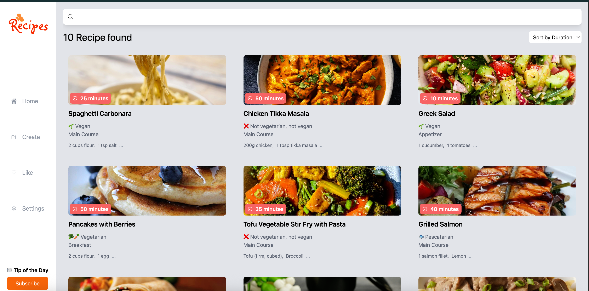
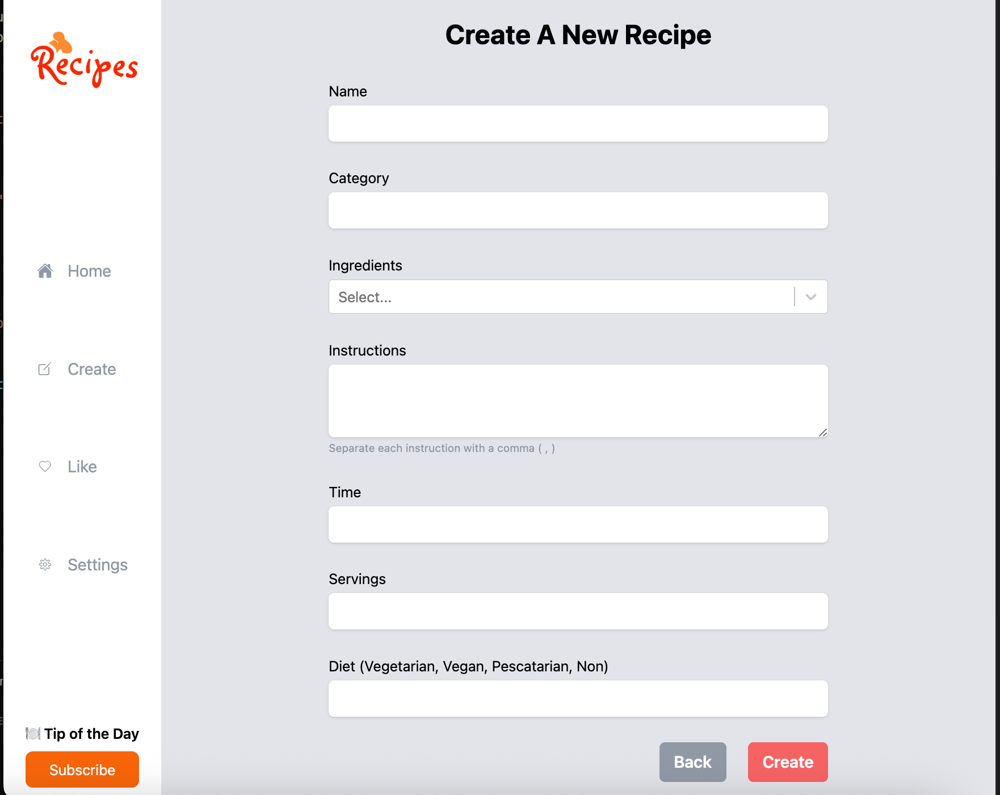
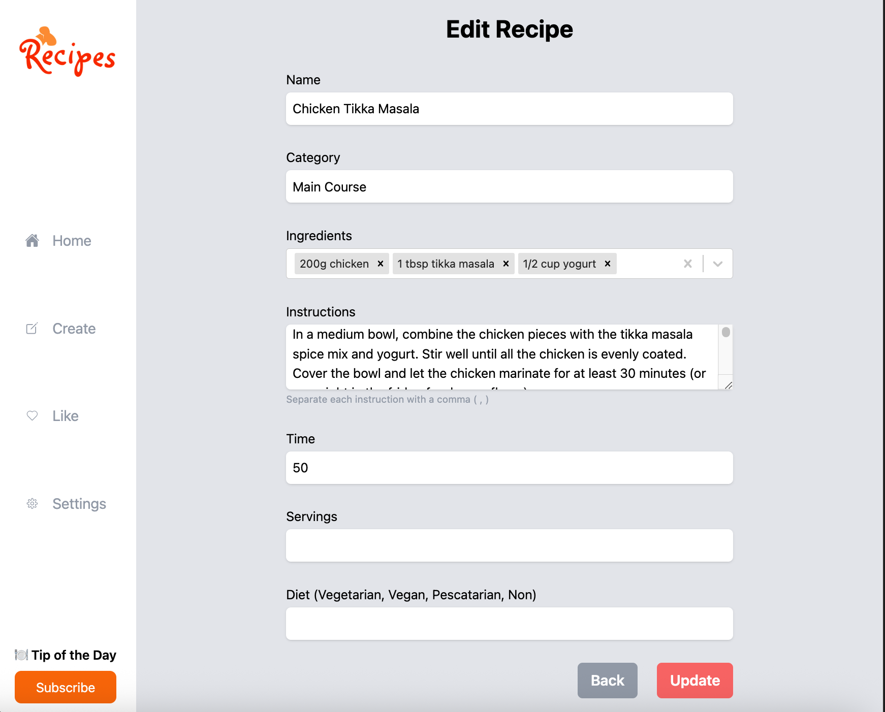
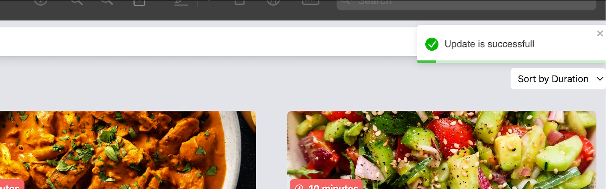
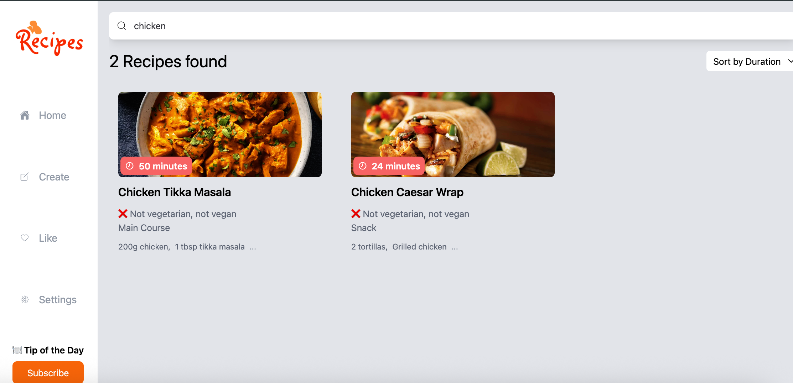

# 🍝 Recipe App

A full-stack Recipe Management App where you can create, view, search, edit, delete, and sort recipes based on preparation time.

## 📸 Screenshots

### 🏠 Home Page

### 📝 Create Recipe Page

### 🗂️ Sort Recipes

### ✏️ Edit Recipe Page

### ✅ Editing Confirmation

###

## 🚀 Technologies Used
### Backend Framework

- express.js
- nodemon
- cors

### Frontend Framework

- react
- react-router-dom
- axios
- @tanstack/react-query
- react-select
- react-icons 
- react-toastify
- tailwind